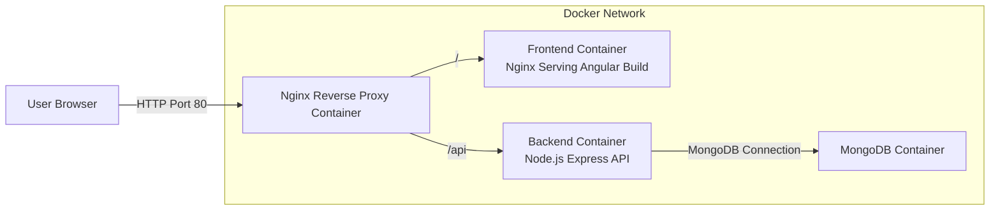
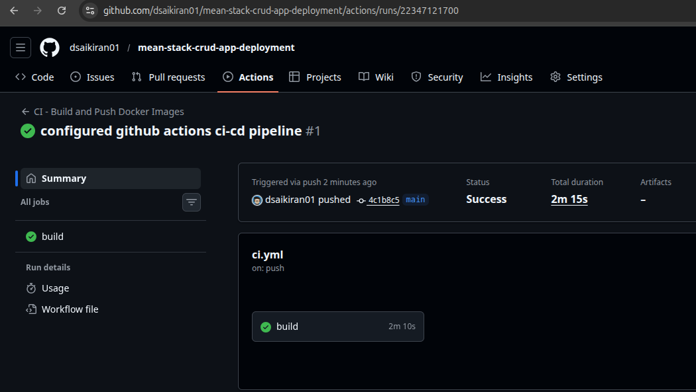
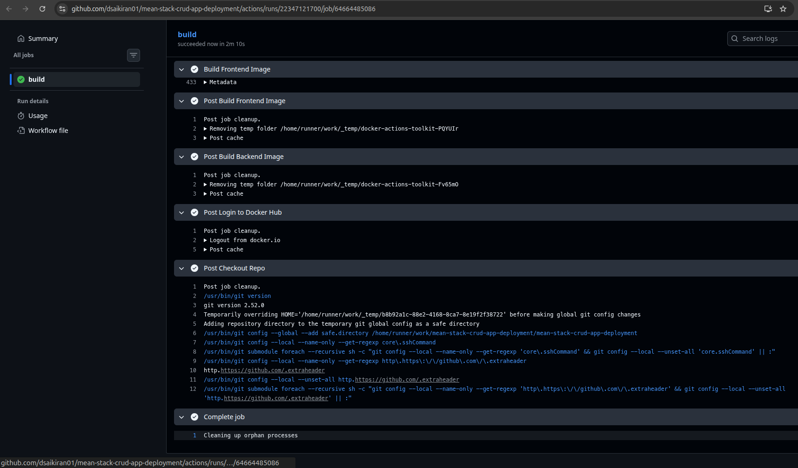
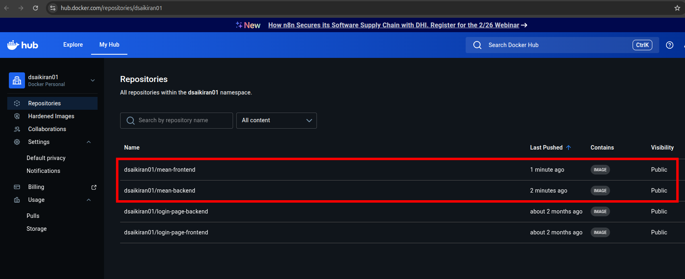
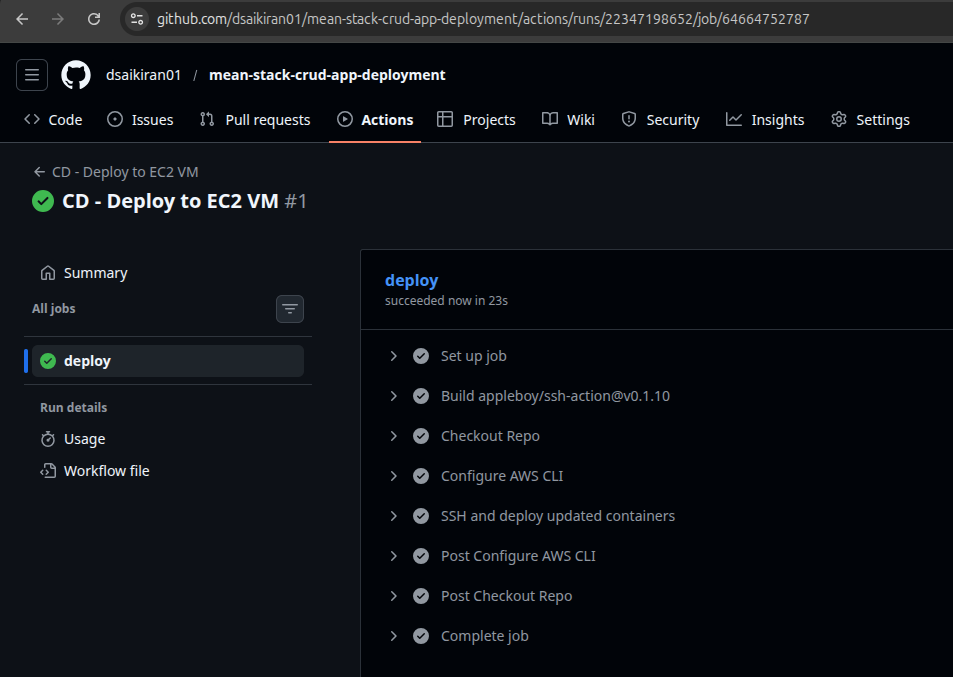
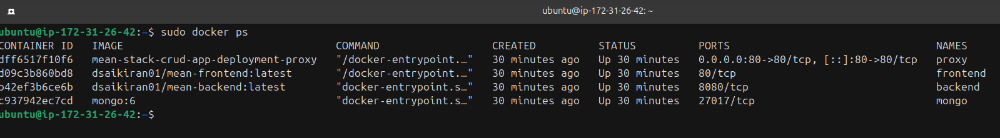
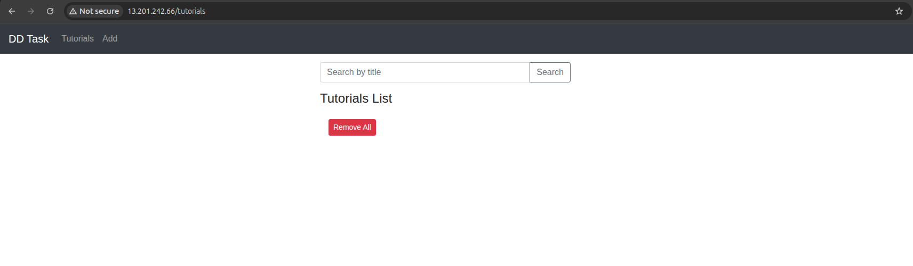
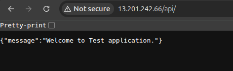

# MEAN Stack Application Deployment with Docker, Nginx, and GitHub Actions CI/CD


## Index
1. [Overview](#1-overview)  
2. [Architecture](#2-architecture)  
3. [Repository Structure](#3-repository-structure)  
4. [Prerequisites](#4-prerequisites)  
5. [Local Development Setup](#5-local-development-setup)  
6. [Dockerization](#6-dockerization)  
   - [Backend](#backend-dockerfile)  
   - [Frontend](#frontend-dockerfile)  
   - [Reverse Proxy](#reverse-proxy-dockerfile)  
7. [Docker Compose Setup](#7-docker-compose-setup)  
8. [Deployment on AWS EC2](#8-deployment-on-aws-ec2)  
   - [EC2 Infrastructure Details](#ec2-infrastructure-details)  
   - [Deployment Steps](#deployment-steps)  
9. [CI/CD Pipeline](#9-cicd-pipeline)  
   - [CI Pipeline](#ci-pipeline-image-building)  
   - [CD Pipeline](#cd-pipeline-automatic-deployment)  
10. [Nginx Configuration](#10-nginx-configuration)  
11. [Screenshots Required](#11-screenshots-required)  
12. [Conclusion](#12-conclusion)

## 1. Overview
This project demonstrates the complete end-to-end deployment of a MEAN (MongoDB, Express.js, Angular, Node.js) application using Docker containers, Nginx reverse proxy, and a fully automated CI/CD pipeline powered by GitHub Actions.

The workflow includes:
- Containerization of backend and frontend
- Static file hosting using Nginx
- Central reverse proxy using Nginx for routing
- Automated image building and pushing to Docker Hub
- Automatic deployment to an AWS EC2 instance


## 2. Architecture

### High-Level Deployment Architecture




## 3. Repository Structure

```
project-root/
│
├── backend/
│   ├── .dockerignore
│   ├── Dockerfile
│   ├── server.js
│   └── package.json
│
├── frontend/
│   ├── .dockerignore
│   ├── Dockerfile
│   ├── nginx.conf
│   ├── src/
│   └── package.json
│
├── proxy/
│   ├── Dockerfile
│   └── nginx.conf
│
├── docker-compose.yml
└── README.md
```


## 4. Prerequisites

### Local Requirements
- Docker  
- Docker Compose  
- Node.js (if running locally before containerization)

### Cloud Requirements
- AWS EC2 Ubuntu instance  
- GitHub repository  
- Docker Hub account  
- GitHub Secrets configured for CI/CD  
  - DOCKERHUB_USERNAME  
  - DOCKERHUB_TOKEN  
  - EC2_HOST  
  - EC2_SSH_USER  
  - EC2_SSH_KEY  
  - AWS_ACCESS_KEY_ID  
  - AWS_SECRET_ACCESS_KEY  
  - AWS_REGION  


## 5. Local Development Setup

To run the backend locally:
```
cd backend
npm install
node server.js
```

To run the frontend locally:
```
cd frontend
npm install
npm run start
```


## 6. Dockerization

### Backend Dockerfile
The backend uses Node.js and connects to MongoDB via an internal Docker network.

### Frontend Dockerfile
The Angular application is built in production mode and served using an Nginx container.

### Reverse Proxy Dockerfile
Handles all inbound traffic and routes `/` to the frontend and `/api` to the backend.

Complete Dockerfiles are inside their respective folders.


## 7. Docker Compose Setup

The `docker-compose.yml` defines four services:
- MongoDB  
- Backend  
- Frontend  
- Reverse Proxy (exposed on port 80)

Deploy locally using:
```
docker compose up --build
```


## 8. Deployment on AWS EC2

### EC2 Infrastructure Details

The following infrastructure configuration was used for deploying the MEAN stack application:

**Operating System**  
- Ubuntu Server 22.04 LTS (64-bit x86)

**Instance Type**  
- ci-7 Flex Large (or equivalent general-purpose instance)
- Suitable resources for Docker, Nginx, Node.js, and MongoDB workloads

**Key Pair**  
- A new EC2 key pair was created during instance launch  
- The corresponding private key (.pem) was added to GitHub Secrets as `EC2_SSH_KEY`  
- This key is used by GitHub Actions to SSH into the server

**Security Group Configuration**

**Inbound Rules**
| Port | Protocol | Purpose |
|------|----------|----------|
| 22   | TCP      | SSH access for deployment |
| 80   | TCP      | HTTP access for the application |
| 443  | TCP      | HTTPS (reserved for future use) |

**Outbound Rules**
| Destination | Protocol | Purpose |
|------------|----------|----------|
| 0.0.0.0/0  | All traffic | Required for pulling Docker images and package updates |

**Storage and Networking**
- Root volume: 20 GB (recommended minimum for Docker images)
- Public IPv4 enabled
- Elastic IP (optional but recommended)


### Deployment Steps

1. Launch an Ubuntu EC2 instance with the above specifications  
2. Connect via SSH using your EC2 key pair  
3. Install system updates and required dependencies  
   ```
   sudo apt update && sudo apt upgrade -y
   sudo apt install docker.io -y
   sudo apt install docker-compose -y
   ```
4. Clone the project repository  
   ```
   git clone https://github.com/dsaikiran01/mean-stack-crud-app-deployment.git
   cd mean-stack-crud-app-deployment
   ```
5. Ensure your docker-compose.yml references Docker Hub images  
6. Start the application  
   ```
   docker compose pull
   docker compose up -d
   ```

The application becomes available at:
```
http://<EC2_PUBLIC_IP>
```


## 9. CI/CD Pipeline

### CI Pipeline (Image Building)
Triggered on push to the `main` branch.
- Builds frontend and backend Docker images
- Tags images as `latest` and `<GITHUB_SHA>`
- Pushes to Docker Hub

Technologies used:
- GitHub Actions
- docker/build-push-action
- Docker Hub registry

File:
```
.github/workflows/ci.yml
```

### CD Pipeline (Automatic Deployment)
Triggered when CI completes successfully.
- Connects to EC2 using SSH
- Pulls the latest Docker images from Docker Hub
- Restarts containers using docker-compose
- Prunes unused images

File:
```
.github/workflows/cd.yml
```


## 10. Nginx Configuration

### Reverse Proxy (proxy/nginx.conf)
Routes:
- `/` to frontend
- `/api/` to backend

### Frontend Nginx (frontend/nginx.conf)
Serves Angular SPA and handles path rewriting using:
```
try_files $uri $uri/ /index.html;
```


## 11. Screenshots Required

### 11.1 CI/CD Configuration



### 11.2 CI Pipeline Execution



### 11.3 Docker Image Build and Push



### 11.4 CD Pipeline Execution



### 11.5 AWS EC2 Deployment



### 11.6 Application Working UI






## 12. Conclusion

This project demonstrates a complete end-to-end DevOps workflow, including containerization, orchestration with Docker Compose, Nginx reverse proxy routing, and a fully automated CI/CD pipeline using GitHub Actions for reliable deployment to AWS EC2. The setup follows industry-standard production practices and provides a robust, scalable deployment model for MEAN stack applications.
